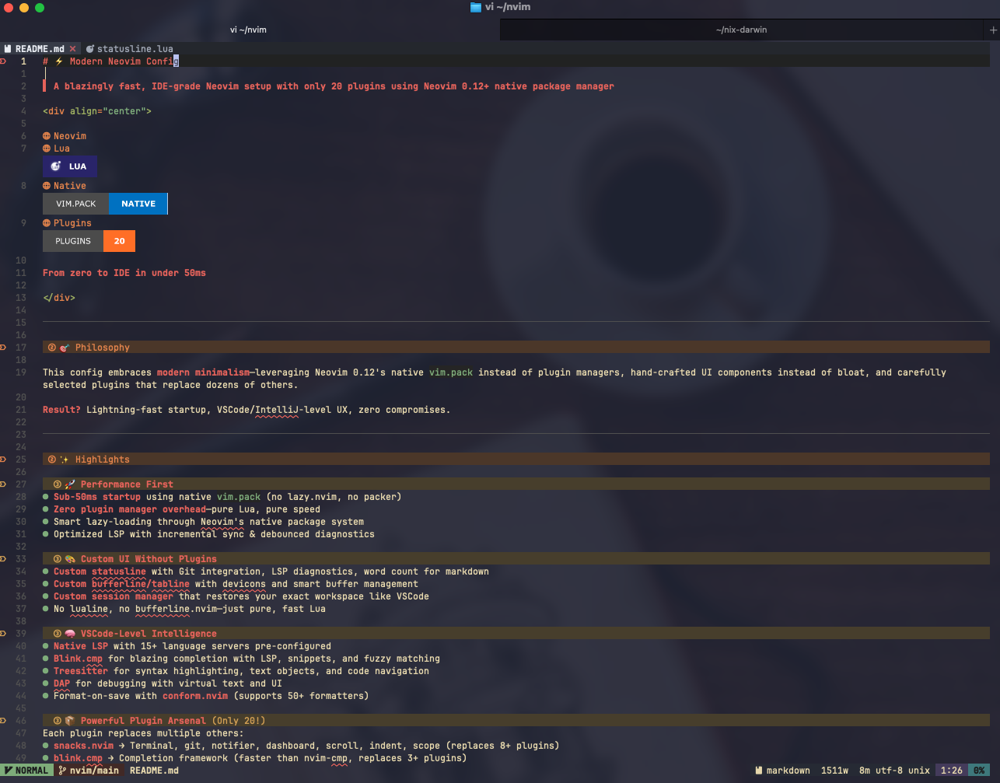

# My Neovim config

> Fast, IDE-grade Neovim setup with 10+ plugins using native `vim.pack` (no plugin manager needed)


- Sub-50ms startup using native `vim.pack` (no lazy.nvim/packer overhead)
- Custom UI components (statusline, tabline, session manager) without extra plugins
- 15+ LSP servers pre-configured with format-on-save
- Session persistence that restores your workspace as VSCode

## Core Plugins

| Plugin                       | Purpose                                                                   |
| ---------------------------- | ------------------------------------------------------------------------- |
| fff.nvim                     | File finder and live grep picker                                          |
| oil.nvim                     | File explorer                                                             |
| blink.cmp                    | Completion with LSP, snippets, fuzzy matching                             |
| nvim-treesitter              | Syntax highlighting, code folding, indentation                            |
| gitsigns.nvim                | Git signs in the gutter, hunk navigation, line blame                      |
| vdiff.nvim                   | Side-by-side diff viewer, merge conflict resolution, gitlab/github review |
| which-key.nvim               | Command palette & keybind helper                                          |
| grug-far.nvim                | Search & replace across files                                             |
| render-markdown.nvim         | Rich markdown rendering in the buffer (browser preview with cli mdserve)  |
| nvim-web-devicons (optional) | File type icons                                                           |
| nvim-dap (optional)          | Debug Adapter Protocol client                                             |
| nvim-dap-view (optional)     | DAP UI panel (scopes, breakpoints, watches, threads)                      |
| codeme.nvim (optional)       | Coding time tracker / dashboard                                           |
| yanky.nvim                   | Yank ring with cycling, history picker, put highlighting                   |

## Minimal custom features (no plugins required)

| Feature           | File                     | Description                                                                                        |
| ----------------- | ------------------------ | -------------------------------------------------------------------------------------------------- |
| Custom Catppuccin | `config/theme.lua`       | Gruvbox-inspired palette, highlight overrides for plugins, syntax, treesitter, LSP semantic tokens |
| Auto-pairs        | `config/pairs.lua`       | Insert-mode auto-close for brackets, and smart backspace                                           |
| Statusline        | `config/statusline.lua`  | Git branch/diff, LSP diagnostics, word count for markdown                                          |
| Tabline           | `config/tabline.lua`     | Smart buffer management with devicons                                                              |
| Session manager   | `config/session.lua`     | Per-directory auto-save/restore                                                                    |
| LSP utilities     | `config/lsp.lua`         | Unified 15+ server setup with format-on-save, inlay hints                                          |
| Diagnostics       | `config/diagnostics.lua` | Custom diagnostic display config                                                                   |
| Pack UI           | `config/pack.lua`        | Browser for `vim.pack` plugin registry                                                             |
| Jump              | `config/jump.lua`        | Minimal 2-char search with label jump                                                              |
| UI overrides      | `config/ui2.lua`         | Floating windows, cmdline                                                                          |

I also wrote a series of articles about my [Neovim config](https://tduyng.com/tags/neovim/)

## Installation

```bash
# Backup existing config
mv ~/.config/nvim ~/.config/nvim.bak

# Clone
git clone https://gitlab.com/tduyng/nvim.git ~/.config/nvim

# Launch (plugins install automatically)
nvim
```

Prerequisites: Neovim 0.13+, Git, Ripgrep, Nerd Font

Update plugins: `<leader>pu` or `:lua vim.pack.update()`

## Development

Validate the config before committing:

```bash
just validate  # Run all checks (loads config in headless nvim + checks formatting)
just check     # Test config loads without errors
just fmt       # Format all Lua files with StyLua
```

## Quick Start

Leader key: `Space`

### Essential keybindings

```
Files & Search
  <leader>ff  Find files (fff.nvim)
  <leader>fg  Live grep (fff.nvim)
  <leader>fw  Grep word/selection (fff.nvim)
  <leader>fc  Find config file (fff.nvim)
  <leader>e   File explorer (oil.nvim)
  <leader>sr  Search & replace (grug-far.nvim)

Buffers
  <leader>fb  Buffer picker
  <leader>bd  Delete buffer
  <leader>bo  Delete other buffers

Windows
  Ctrl-h/j/k/l  Navigate windows
  <leader>sv    Vertical split
  <leader>sh    Horizontal split

LSP (native)
  gd            Goto definition
  gD            Goto declaration
  gR            References
  gI            Goto implementation
  gy            Goto type definition
  <leader>ss    Document symbols
  <leader>sS    Workspace symbols
  gai           Incoming calls
  gao           Outgoing calls

Git
  <leader>gg    LazyGit
  <leader>gc    Git: compare (universal)
  <leader>gC    Git: compare two refs
  <leader>gd    Git: working tree diff
  <leader>gD    Git: staged diff
  <leader>gf    Git: diff file vs HEAD
  <leader>gF    Git: diff file (universal)
  <leader>gV    Git: file history
  <leader>gv    Git: line history
  <leader>gx    Git: close all
  <leader>gm    Git: merge conflicts
  <leader>gr    Git: review prefix

Sessions
  <leader>qs    Load session (cwd)
  <leader>ql    Load last session

Debug (DAP)
  <leader>db    Toggle breakpoint
  <leader>dc    Continue
  <leader>du    Toggle DAP view
  <leader>di    Step into
  <leader>do    Step over

Other
  <leader>y     Yank history picker
  <C-p>/<C-n>   Cycle yank history forward/backward
  <leader>z     Toggle Zen Mode
  <leader>uw    Toggle wrap
  <leader>uL    Toggle relative number
  <leader>ul    Toggle line number
  <leader>ud    Toggle diagnostics
  <leader>uc    Toggle conceal level
  <leader>uA    Toggle tabline
  <leader>uT    Toggle treesitter
```

A lot of keymaps as in [Lazyvim/keymaps](https://www.lazyvim.org/keymaps).

## Screenshots




---

## License

MIT
